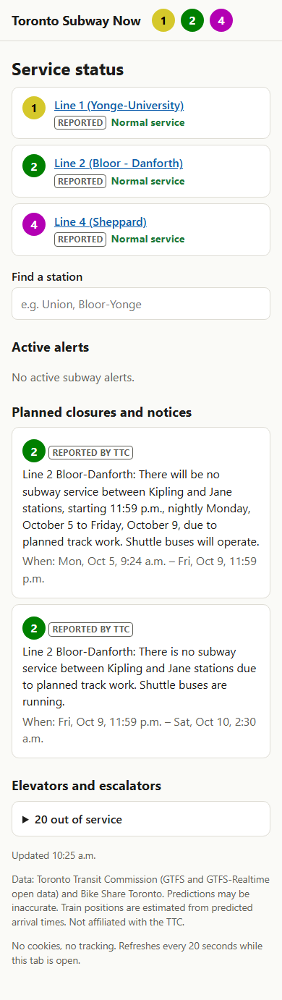
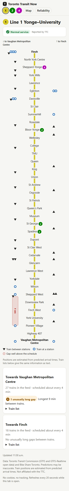
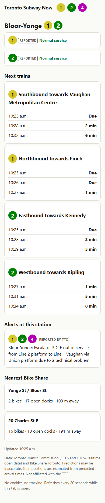
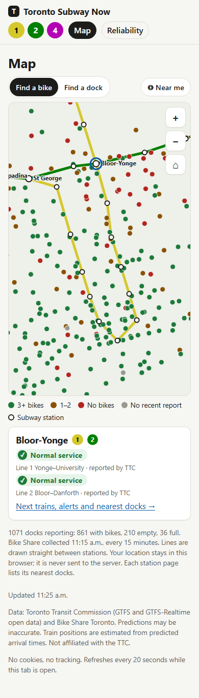
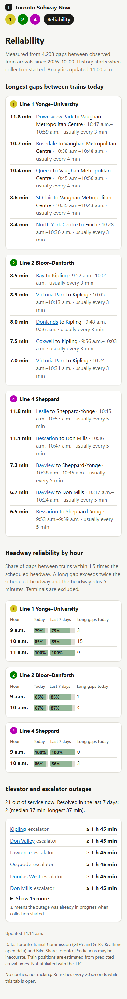

# Public site and API

`web` serves **Toronto Transit Now**: a read-only JSON API and a single mobile-first page. It reads only from
PostgreSQL; browsers never call the TTC or Bike Share APIs.

```powershell
docker compose up -d web
```

Open <http://localhost:8000>. Pages use hash routes: `#/` (service status), `#/line/1`
(line view), `#/station/bloor-yonge` (station), `#/map` (subway and Bike Share map; `#/map/bloor-yonge`
opens it on a station), `#/reliability` (reliability), `#/pipeline` (pipeline status).

| Home | Line | Station | Map | Reliability |
| --- | --- | --- | --- | --- |
|  |  |  |  |  |

Screenshots were captured from real data on 2026-10-09 at about noon Toronto time,
about 2 h 30 min after collection started.

## Endpoints

| Path | Returns |
| --- | --- |
| `/api/status` | One status row per line: `normal`, `delays`, `reduced_service`, `modified_service`, `no_service`, or `unknown` when alerts are stale. `source` is `reported` (from TTC alerts). `detected` holds our own possible-delay inference, only when TTC reports nothing. |
| `/api/alerts` | Active service alerts, upcoming planned closures and advance notices, and active elevator/escalator outages. |
| `/api/lines` | Lines with colours, directions and status, plus every station for search. |
| `/api/lines/{id}` | Stations in order, estimated train positions, gaps between consecutive trains, and the scheduled headway now. |
| `/api/stations/{key}` | Next arrivals per platform, alerts naming the station's platforms, line status, and the nearest Bike Share docks. |
| `/api/map` | Each line's path through its stations, station coordinates, and every Bike Share dock from the latest collection with bikes, open docks and capacity. |
| `/api/reliability` | Longest gaps today, regular-headway share by hour (today and 7 days), and elevator/escalator outages, from the dbt models. `available: false` until the first build. |
| `/api/pipeline` | Health of each TTC feed, Bike Share collection and the dbt build (`ok`, `delayed` or `failing` by time since the last success), today's feed dropout rate, the latest data-quality checks and data volume. Shown at `#/pipeline`. |
| `/api/datasets` | The open-data index: datasets, column descriptions, and every published file with rows and checksums. `available: false` before the first export. Files are served under `/data/`. See [open data](datasets.md). |
| `/health` | `ok`, `degraded` (predictions older than 2 minutes), `no_data` (no schedule loaded), or HTTP 503 if PostgreSQL is unreachable. |

Every response includes `generated_at` and the attribution. Freshness objects
(`as_of`, `stale`) accompany predictions, alerts and Bike Share data.

## How positions, gaps and status are derived

Reliability metrics and detected delays are defined in [reliability analytics](reliability.md).

- **Train position.** The subway feed has no vehicle positions. TTC often predicts a
  train's first listed platform at the current time even while it is between stations,
  so the next platform is the first predicted more than 20 seconds ahead. If that
  arrival is further away than the scheduled run from the previous platform, the train
  has not left the previous platform; otherwise it is placed between the two in
  proportion to the remaining time. Scheduled run times are medians from static GTFS.
- **Gaps.** Consecutive moving trains in a direction are separated by the scheduled
  running time between their positions. A gap is marked long when it exceeds both twice
  the scheduled headway and the headway plus 5 minutes. The headway counts trips in the
  next/previous 30 minutes at a mid-line platform on today's service calendar. Trains
  waiting at their first platform are excluded.
- **Status.** The most severe active TTC service alert on the line. Advance notices
  ("There will be no subway service ... nightly") are listed under planned closures and
  do not change today's status, because TTC sets their active period to the whole notice
  window rather than the closure hours.

## Map

The map draws subway lines, stations and every Bike Share dock from their own coordinates
in SVG, with no map tiles, so the page still makes no third-party requests. Docks are
coloured by bikes available ("Find a bike") or open docks ("Find a dock"). A dock that is
not installed, or whose own report is more than 30 minutes old, is grey and makes no
availability claim, the same rule the dashboard uses. Tapping picks the nearest station or
dock within finger reach. "Near me" uses the browser's location to select the nearest dock
with bikes (or open docks); the location stays in the browser. Lines are drawn straight
between stations. The map refreshes every 2 minutes rather than every 20 seconds, since
Bike Share data changes every 15 minutes, and never during a drag or pinch.

## Protection

- Responses are cached in memory for 15 seconds, so PostgreSQL load does not grow with
  visitors. Schedule-derived data is cached until a new static GTFS version loads.
- Responses over 1 KB are gzip-compressed (the map's dock list shrinks from about
  200 KB to 35 KB).
- `/api/` allows `WEB_RATE_LIMIT_PER_MINUTE` (default 120) requests per client address
  per sliding minute, then returns 429 with `Retry-After`.
- A strict Content Security Policy allows only same-origin scripts, styles and requests.
  The page has no cookies, analytics or third-party resources, and renders API text with
  `textContent` only.

## Accessibility

Semantic headings and lists, a skip link, visible focus, text equivalents for the line
diagram (train lists and gap summaries), status text that never relies on colour alone,
light and dark themes, and reduced motion respected. The page refreshes every 20 seconds
while visible; a refresh keeps typed search text, focus, open panels and scroll
position, and a failed refresh keeps the last data on screen with a notice instead of
replacing it with an error.
